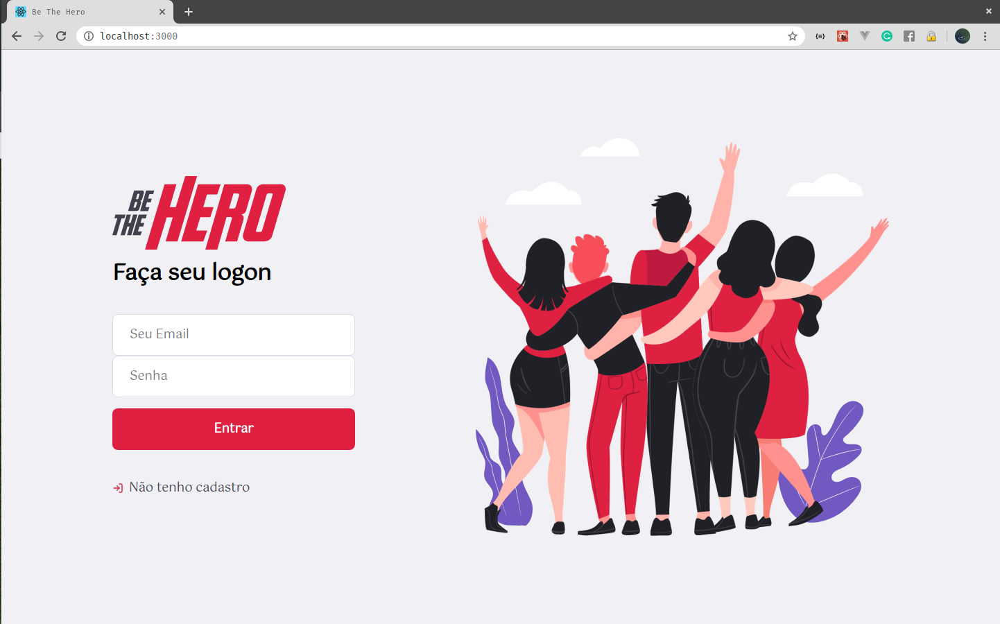
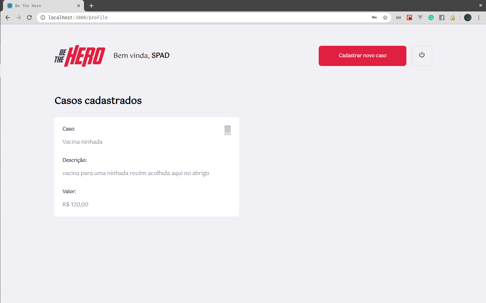
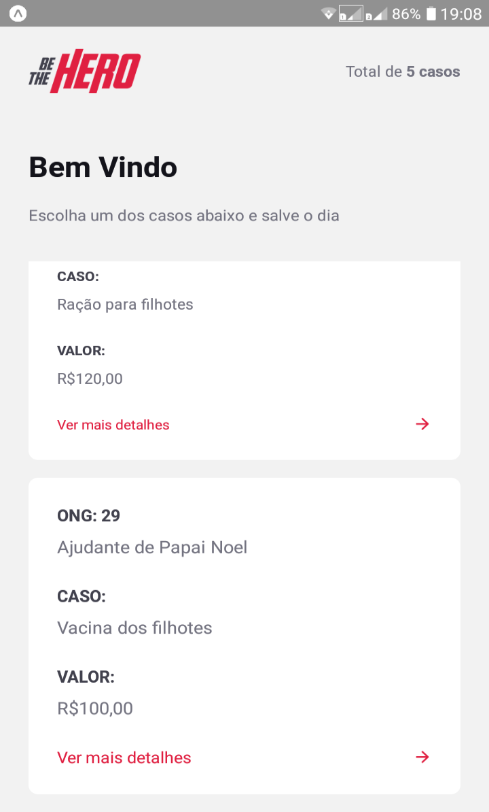

# Semana OmniStack 11

**Projeto** Be The Hero 

**By** [RocketSeat](http://rocketseat.com.br)

```
A ideia do curso é aprender o básico das tecnologias NodeJs, ReactJs e React Native e com elas desenvolver uma pequena aplicação de teste conectando backend, frontend e mobile. 
```

- eu fiz umas alterações no projeto inicial proposto pela RocketSeat, incluí o campo de senha e alterei a forma como a ID é gerada para o UUID-V4

## backend - NodeJS

## frontweb - ReactJS






## frontmobile - React Native




### Autor

(Marcelo Ratton)[https://linkedin.com/in/rattones]